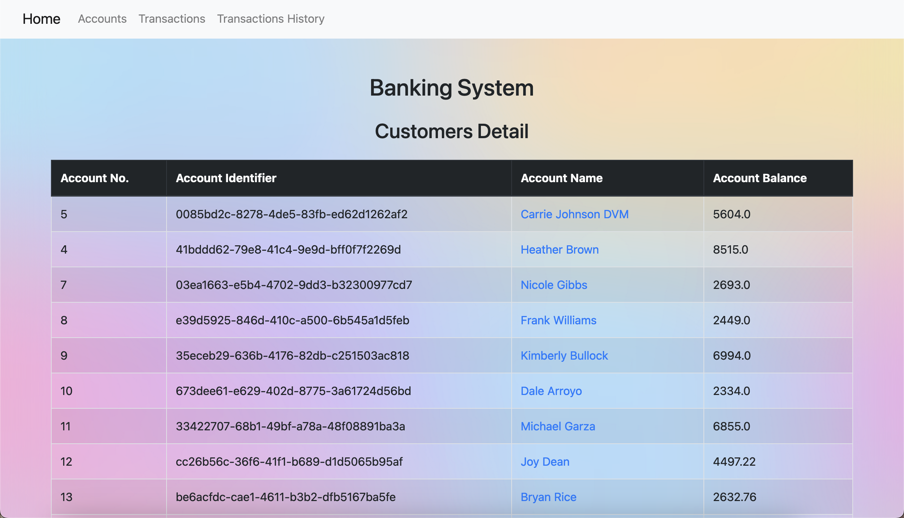

# Account-transfer-task

This is a Django-based web application for a basic banking system that allows users to upload account data via CSV, view account details, and perform transactions between accounts.

## Features

- **Upload CSV Files**: Allows uploading account data in CSV format.
  
- **View Accounts**: Displays a list of all accounts.
  
- **Account Details**: Viewing account details including all transaction related to this account.
  
  
- **Perform Transactions**: Enables transferring funds between accounts.
  
- **Transactions History**: Viewing all transferring funds between accounts.
  

  
## Requirements

- Python 3.10
- Django 5.0.6
- PostgreSQL 13
- Docker

## Project Setup

### Prerequisites

Ensure you have the following installed:

- Python 3.10
- Docker
- Docker Compose

### Installation

1. **Clone the repository**:

    ```sh
    git clone https://github.com/shahdhesham5/Docspert-Health-Task.git
    cd Account-transfer-task
    ```

2. **Create a `.env` file and venv **:

    Create a `.env` file in the project root directory with the following content:

    ```env
    DB_HOST=db
    DB_NAME=postgresdb
    DB_USER=postgres
    DB_PASSWORD=1234
    DB_PORT=5432
    
    # Django settings
    DEBUG=True
    ALLOWED_HOSTS=localhost,127.0.0.1,0.0.0.0


    ```
   Create a virtualenv and activate it:
   ```sh
      python3 -m venv venv
      source venv/bin/activate
   ```
4. **Build and run the Docker containers**:

    ```sh
    docker-compose up --build
    ```

5. **Create a superuser**:

    ```sh
    docker-compose exec django_bank python manage.py createsuperuser
    ```

6. **Run the development server**:

    The development server should already be running from the `docker-compose up` command. You can access it at `http://localhost:8000`.

## Usage

### Uploading CSV Files

1. Go to the home page.
2. Use the upload form to select and upload a CSV file containing account data.
3. The file should have columns: Identifier, Name, Balance.

### Viewing Accounts

1. Navigate to the "Accounts" page.
2. All uploaded accounts will be displayed in a table format.
3. Click on any account name to view all account details.

### Performing Transactions

1. Go to the "Transactions" page.
2. Select the source account and the destination account from the dropdown menus.
3. Enter the amount to be transferred and submit the form.

### Transactions History 

1. Go to the "Transactions History" page.
2. All transactions detials are displayed.


## Running Tests
  **Run tests**:
    ```sh
      docker-compose exec -it django_bank python manage.py test
    ```

